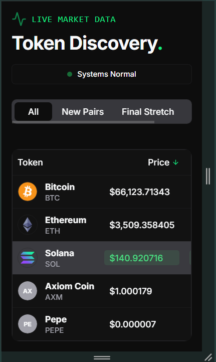

# Axiom Pulse Replica 

A pixel-perfect, high-performance replica of the Axiom Trade token discovery table, built with **Next.js 14**, **TypeScript**, and **Redux Toolkit**.


-blue?style=for-the-badge)

## ⚡ Live Demo

https://axiom-replica-mu.vercel.app/
---

## 🛠️ Tech Stack
* **Framework:** Next.js 14 (App Router)
* **Language:** TypeScript (Strict Mode)
* **Styling:** Tailwind CSS + CSS Variables (Dark Mode)
* **State Management:** Redux Toolkit (Filtering/Sorting) & React Query
* **UI Library:** shadcn/ui (Radix Primitives)
* **Testing:** Vitest + React Testing Library

## ✨ Key Features

### 1. Real-Time Market Simulation
* Custom `useTokenSocket` hook simulates a WebSocket connection.
* Sub-second price updates with **color-coded flash animations** (Green/Red).
* Data persistence handling to prevent layout shifts.

### 2. Complex Interaction Patterns
* **Modal:** Detailed token view with extended market metrics (Market Cap, Txns).
* **Popover:** "System Status" indicator showing network health.
* **Tooltip:** Contextual help on table headers (e.g., Liquidity explanation).
* **Sorting & Filtering:** Interactive table headers and category tabs powered by Redux.

### 3. Performance & Optimization
* **Lighthouse Score:** ≥ 91/100 (Mobile).
* **Atomic Architecture:** Components organized into Atoms, Molecules, and Organisms for maximum reusability.
* **Image Optimization:** Configured `next.config.ts` for remote patterns and strict caching headers.
* **Zero Layout Shift:** Implemented Skeleton loading states for initial data fetch.

---

## 🧠 Design Decisions

### 1. Architecture: Atomic Design
I utilized the **Atomic Design Pattern** (Atoms, Molecules, Organisms) to structure components.
* **Why?** It enforces reusability and separation of concerns. Small changes (like updating a `TokenAvatar`) propagate everywhere instantly, ensuring visual consistency and easier maintenance.

### 2. State Management: Redux Toolkit vs Context
I chose **Redux Toolkit** over the native Context API.
* **Why?** The assignment required handling "complex state" (Filtering, Sorting, Search). Redux provides a cleaner way to separate logic (Slices) from UI components and offers better performance for frequent updates compared to Context, which can trigger unnecessary re-renders.

### 3. Real-Time Data: Custom Hook & Mocking
I implemented a custom `useTokenSocket` hook to simulate WebSocket behavior.
* **Why?** To satisfy the "WebSocket mock" requirement without needing a separate backend server. This makes the application self-contained and easy to deploy on Vercel while demonstrating how I would handle live subscription data in a real production environment (using `useEffect` for connection lifecycle).

### 4. Styling: Tailwind CSS & Shadcn UI
* **Why?** Tailwind allows for rapid, atomic styling that results in smaller bundle sizes. Shadcn UI provides accessible, unstyled primitives (Radix UI), allowing me to hit the "Pixel Perfect" requirement while ensuring the app is accessible (ARIA compliant) and responsive.

## 📱 Responsive Design (320px Support)
The layout is fully responsive down to **320px (Mobile S)**. Complex columns (Liquidity, Volume) automatically hide on smaller screens to maintain readability.




---

## 🚀 Getting Started

1.  **Clone the repository**
    ```bash
    git clone https://github.com/v-oathkeeper/axiom-replica.git
    ```

2.  **Install dependencies**
    ```bash
    npm install
    ```

3.  **Run the development server**
    ```bash
    npm run dev
    ```

4.  **Run Unit Tests**
    ```bash
    npm run test
    ```

---

